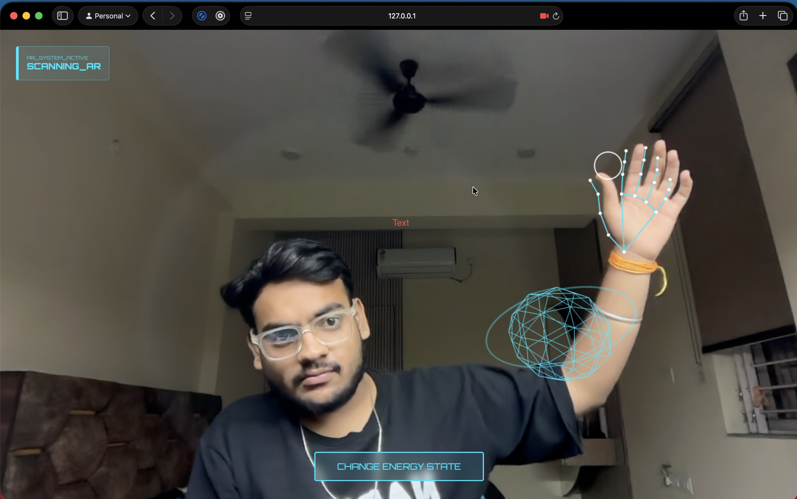
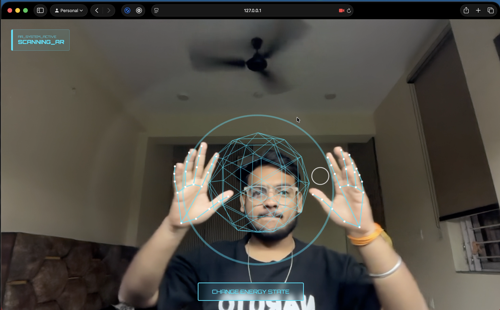

# 🧠 JARVIS MARK XI – Live AR HUD System

A futuristic **Iron Man–inspired AR HUD** built using **MediaPipe Hands + Three.js**, enabling **real-time hand tracking**, **gesture-based 3D interaction**, and a **glassmorphism HUD interface** — all running directly in the browser.

> ⚡ No installations • No backend • Pure Web AR

---

## ✨ Features

🖐️ **Real-Time Hand Skeleton Tracking**  
🎯 **Pinch-to-Grab 3D Object Control**  
🔍 **Two-Hand Zoom & Scale Interaction**  
🧊 **Glassmorphism HUD (JARVIS-style UI)**  
🧭 **AR Reticle & Gesture Pointer**  
🎨 **Gesture-Activated Energy State Toggle**  
🪐 **Three.js 3D Core + Ring System**  
📷 **Live Camera Feed Integration**

---

## 🛠️ Tech Stack

| Technology | Usage |
|---------|------|
| **HTML5** | AR viewport & UI |
| **CSS3** | Glassmorphism HUD |
| **JavaScript** | Core logic |
| **MediaPipe Hands** | Hand & gesture tracking |
| **Three.js** | 3D rendering |
| **WebGL** | Hardware-accelerated graphics |

---

## 🚀 Live Demo

🔗 **Live AR HUD:**  

https://github.com/user-attachments/assets/33bbe80f-05dd-41b7-b5f6-9af9e37fdd5e

> ⚠️ **Best experienced on Desktop (Chrome / Edge)**  
> Camera access required.

---

## 🖼️ Preview

 

## 🧩 How It Works

### 🖐️ Gesture Controls

| Gesture | Action |
|------|------|
| Pinch (Thumb + Index) | Grab & move 3D object |
| Two Hands Apart | Scale / Zoom object |
| Pinch over HUD Button | Change energy state |
| Open Hand | Scan mode |

---

### 🔄 Rendering Stack

Camera Feed

↓

Hand Tracking (MediaPipe)

↓

Gesture Mapping

↓

Three.js 3D Scene

↓

HUD Overlay

--- 

## 🧠 Inspiration
*Inspired by:*

**Iron Man / J.A.R.V.I.S HUD** 
**Futuristic AR interfaces** 
**Human-Computer Interaction (HCI)** 
**Web-based Augmented Reality** 

## 📌 Future Enhancements
🧤 **Hand mesh depth occlusion** 
🗣️ **Voice commands (Web Speech API)** 
🎮 **Gesture-based UI panels** 
🌐 **WebXR / AR glasses support** 
🧠 **AI assistant overlay** 

--- 

## 👤 Author
**Vinayak Hariharno** 
💻 **Web AR • Computer Vision • Creative Tech** 
🔗 GitHub: https://github.com/vinayak-hariharno 
🔗 LinkedIn: https://www.linkedin.com/in/vinayak-hariharno-a05895326/ 

<h2 align="center">📜 License</h2>
<h3 align="center">MIT License © 2026   Free to use, modify & distribure</h3>
